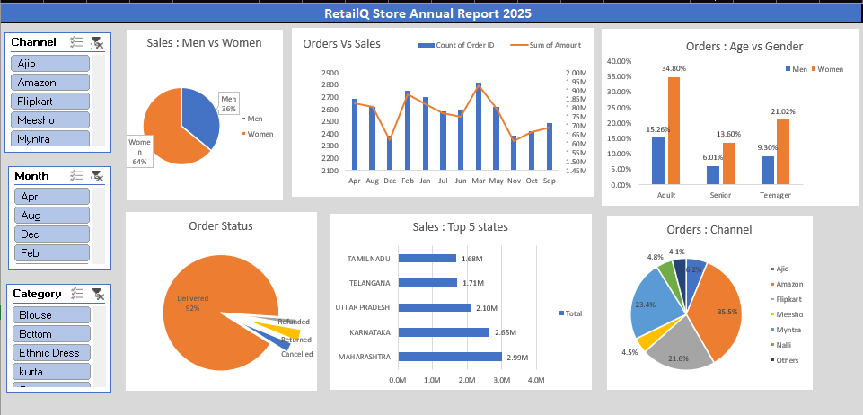

#  Excel Sales Dashboard

An interactive and visually appealing **Excel Dashboard** created to analyze key business metrics like revenue, profit, sales trends, and category-wise performance. Ideal for decision-making and business insights.

---

##  Features

-  **Dynamic Charts** – Bar, Pie, and Line Charts for better visualization
-  **Category & Region Filter** – Quick insights through slicers
-  **Professional Dashboard Layout** – Clean, minimal, and informative

---

## 📸 Screenshot

---

## 🛠 Tools Used

- Microsoft Excel 365
- PivotTables & Charts
- Conditional Formatting
- Slicers
- Excel Formulas

---

## How to Use

1. Download the Excel file from the [Readme](#) section.
2. Open in Microsoft Excel (365 or newer recommended).
3. Use filters and slicers to explore various insights.
4. Customize it with your own data for reuse.

---

##  Contact

If you found this project helpful or have any suggestions, feel free to connect:

- 💼 [LinkedIn]([https://www.linkedin.com/in/your-profile](https://www.linkedin.com/in/sumit-soni-892323266/))
- ✉️ sumitsoninita@gmail.com

---

⭐ *Don’t forget to star this repo if you liked the project!*
